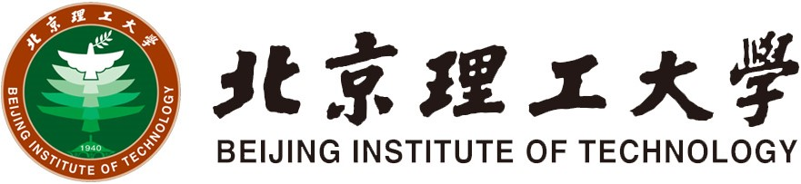
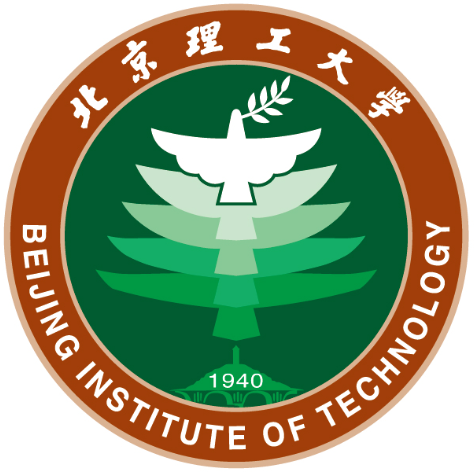
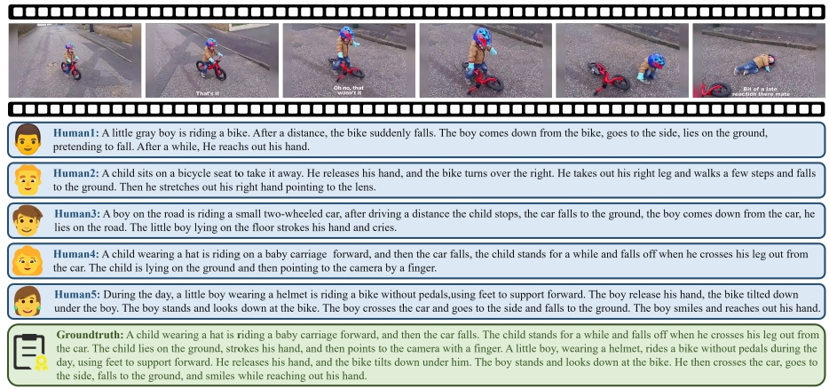








# 👨🏻‍💻 About Me

I am **Xuzhao Li (李旭钊)**, a first-year M.S. student at **<a href="https://english.bit.edu.cn/">Beijing Institute of Technology</a>** (BIT ), supervised by **<a href="https://ac.bit.edu.cn/szdw/jsml/mssbyznxtyjs1/8285660de0654bf69d52aa08987e752d.htm">Prof. Fang Deng</a>**.

Before that, I received my B.E. degree in Automation at **<a href="https://ac.bit.edu.cn/">School of Automation</a>** (AC ) from **<a href="https://english.bit.edu.cn/">Beijing Institute of Technology</a>** (BIT ) in Jun. 2024.

I am grateful to be growing up and studying with my twin brother **<a href="https://xuchen-li.github.io/">Xuchen Li</a>**, which is a truly unique and special experience for me.

My research focuses on **Multi-agent Path Planning**, **Trajectory Prediction** and **Large Language Model**. If you are interested in my work or would like to collaborate, please feel free to contact me.

# 🔥 News
- **2024.09**: 📣 Start my M.S. life at **Beijing Institute of Technology** (BIT), which is located in Haidian District, Beijing.
- **2024.08**: 🏆 Obtain **Key Project of Bachelor’s Degree Thesis (学士学位论文重点项目)** (only 14 students obtain this honor of AC, BIT)!
- **2024.06**: 👨‍🎓 Obtain my B.E. degree from **Beijing Institute of Technology** (BIT). I will always remember the wonderful 4 years I spent here. Thanks to all!
- **2024.05**: 🏆 Obtain **TeliXu Scholarship (徐特立奖学金)** (~8/15000, the highest honor in BIT)!
- **2024.04**: 🏆 Obtain **Beijing Outstanding Graduates (北京市优秀毕业生)** (top %5, only 14 students obtain this honor of AC, BIT)!
- **2023.12**: 🏆 Obtain **China National Scholarship (国家奖学金)** with a rank of **1/196 (0.5%)** (Top 2%, the highest honor for undergraduates in China)!
- **2023.11**: 🏆 Obtain **Merit Student Pacesetter (北京理工大学优秀学生标兵)** (only 1 student obtain this honor of AC, BIT)!
- **2022.12**: 🏆 Obtain **China National Scholarship (国家奖学金)** with a rank of **4/255 (1.5%)** (Top 2%, the highest honor for undergraduates in China)!

# 📖 Educations

2024.09 - now, M.S. student 
Pattern Recognition and Intelligent System 
School of Automation 
<b>Beijing Institute of Technology</b>, Beijing

2020.09 - 2024.07, Undergraduate student 
Automation, GPA: 3.9/4.0, ranking 3/196, Overall Ranking 4/196 (2%) 
School of Automation 
<b>Beijing Institute of Technology</b>, Beijing

# 💻 Research Experiences

* **2023.05 - 2023.10**: Member of Artificial Intelligence Elites Class at **[Institute of Automation, Chinese Academy of Sciences](http://english.ia.cas.cn/)** (CASIA ), advised by Prof. [**Hongbin Liu**](https://people.ucas.edu.cn/~liuhongbin).
* **2023.03 - 2023.04**: Research intern on Event-triggered perception, learning and control at **[Beijing Institute of Technology](https://english.bit.edu.cn/)** (BIT ), advised by Prof. [**Dawei Shi**](https://ac.bit.edu.cn/szdw/jsml/zngzyydkzyjs1/1c32a72eed8b4974a4a7f5a5c60aa621.htm).

# 📝 Publications

## ☑️ Ongoing

CAAI-A

**Can LVLMs Describe Videos like Humans? A Five-in-One Video Annotations Benchmark for Better Human-Machine Comparison**
[Shiyu Hu](https://huuuuusy.github.io/)\*, [Xuchen Li](https://xuchen-li.github.io/)\*, ***Xuzhao Li***, Jing Zhang, Yipei Wang, [Xin Zhao](https://www.xinzhaoai.com/), [Kang Hao Cheong](https://dr.ntu.edu.sg/cris/rp/rp02319) (*Equal Contributions)

Submitted to a CAAI-A conference, Under Review 
📌 LVLM  📌 Evaluation Technology  📌 Human-Machine Comparison

# 🎖 Honors and Awards

* **TeliXu Scholarship (徐特立奖学金)**, ~8/15000, at Beijing Institute of Technology, 2024
* **China National Scholarship (国家奖学金)**, My Rank: 1/196 (0.5%), at BIT, by Ministry of Education of China, 2023
* **China National Scholarship (国家奖学金)**, My Rank: 4/255 (1.5%), at BIT, by Ministry of Education of China, 2022
* **Beijing Outstanding Graduates (北京市优秀毕业生)**, at BIT, by Beijing Municipal Education Commission, 2024
* **Key Project of Bachelor’s Degree Thesis (学士学位论文重点项目)**, at Beijing Institute of Technology, 2024
* **Merit Student Pacesetter (北京理工大学优秀学生标兵)**, at Beijing Institute of Technology, 2023

# 🔗 Services
* Reviewer: 

  International Conference on Pattern Recognition (ICPR)

<body>

</body>

  

    
         &copy; Xuzhao Li | Last updated: Oct. 2024
    
  

